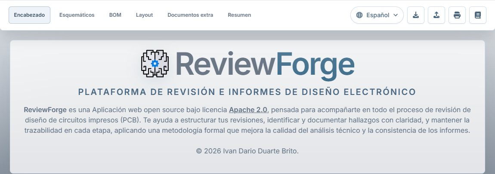
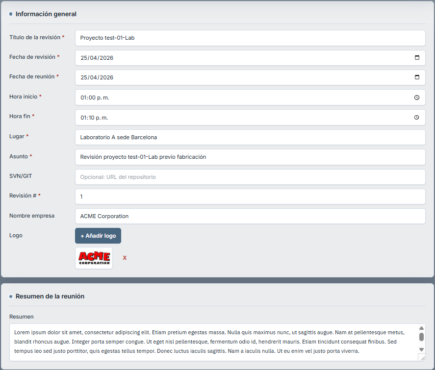
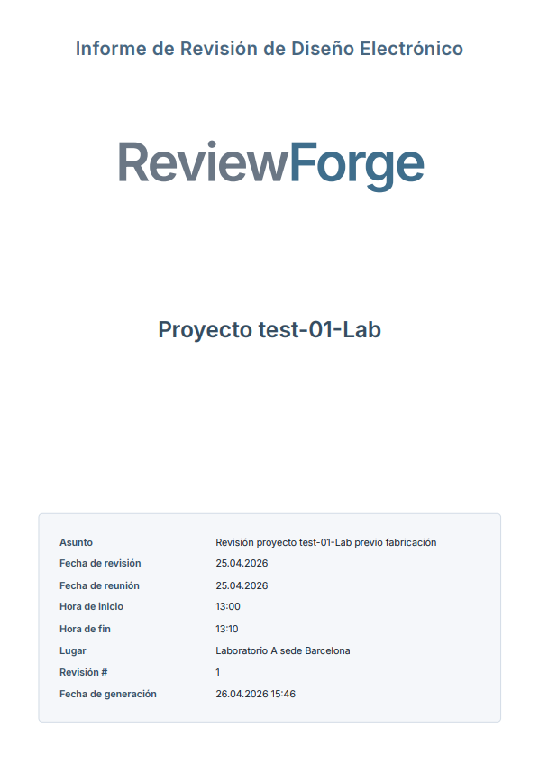
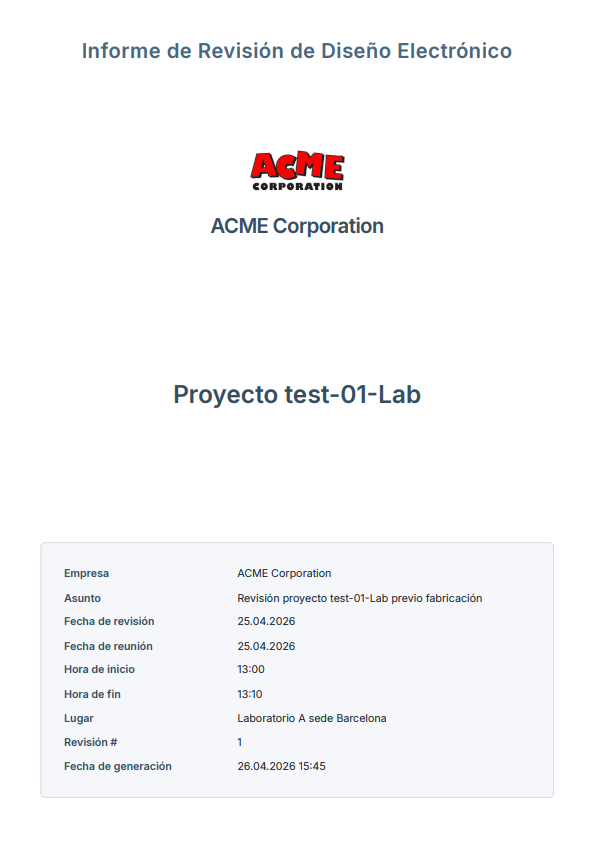
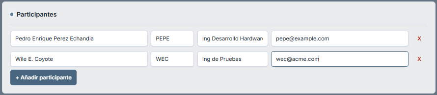
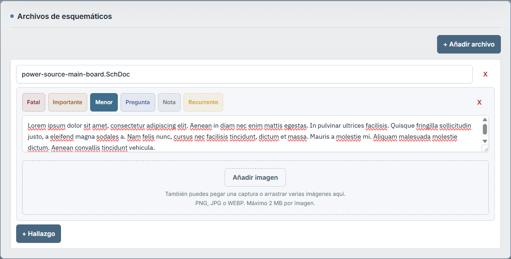
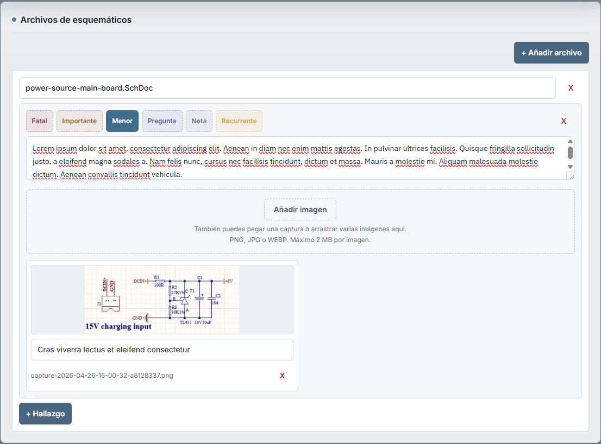
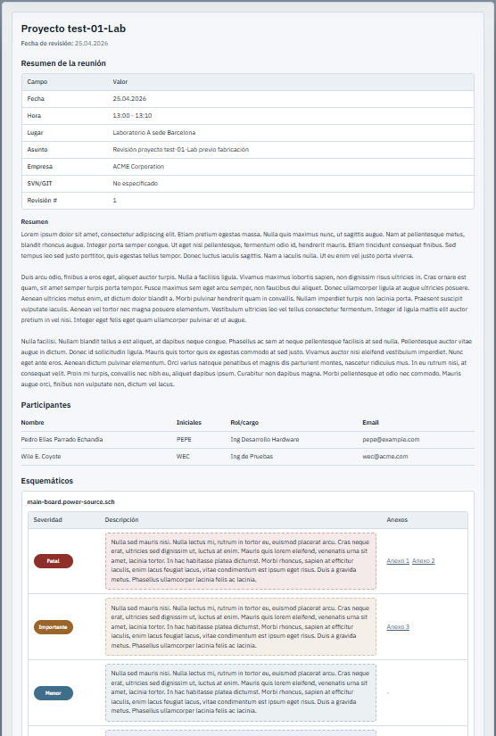
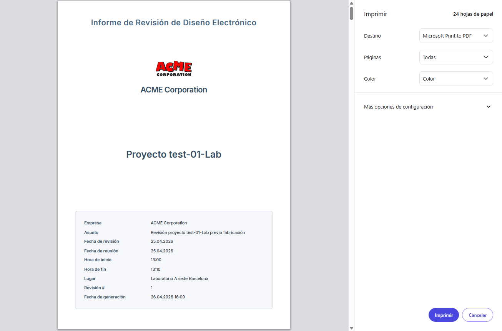
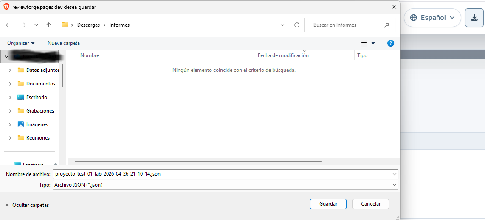

# Guía de uso — ReviewForge

ReviewForge es una aplicación web para conducir revisiones técnicas de diseño electrónico (PCB) y generar informes profesionales en formato PDF. Permite registrar la información de la reunión, los participantes, los hallazgos por archivo revisado y las imágenes de evidencia, y exportar todo como un informe estructurado listo para archivar o compartir.

Esta guía está pensada para quien abre ReviewForge por primera vez.

---

## Interfaz general

Al abrir ReviewForge verás una barra fija en la parte superior con dos zonas.



**Zona izquierda — pestañas de navegación:**

| Pestaña | Contenido |
|---|---|
| **Encabezado** | Información general de la revisión y participantes |
| **Esquemáticos** | Archivos de esquemáticos revisados |
| **BOM** | Archivos de lista de materiales |
| **Layout** | Archivos de layout |
| **Documentos extra** | Cualquier otro material revisado |
| **Resumen** | Vista previa del informe completo |

**Zona derecha — botones de acción:**

| Botón | Función |
|---|---|
| 🌐 Selector de idioma | Cambia entre Español e English |
| Guardar avance | Descarga un archivo `.json` con todo el estado actual |
| Restaurar avance | Carga un archivo `.json` guardado anteriormente |
| Imprimir / Guardar PDF | Abre el diálogo del navegador para exportar el informe como PDF |
| Guía de uso | Abre esta guía en el repositorio de GitHub (pestaña nueva) |

> El botón **Imprimir / Guardar PDF** solo se activa cuando el informe es válido. Mientras haya campos obligatorios incompletos o con errores de formato, permanece deshabilitado.

---

## Flujo de trabajo recomendado

Este es el recorrido completo de una revisión típica:

1. Completa el **Encabezado** con los datos generales de la reunión
2. Agrega los **Participantes**
3. Registra los archivos revisados en **Esquemáticos**, **BOM**, **Layout** y/o **Documentos extra**
4. Añade **hallazgos** a cada archivo con su severidad y descripción
5. Adjunta **imágenes** de evidencia a los hallazgos que lo requieran
6. Revisa la pestaña **Resumen** para verificar que todo esté correcto
7. Corrige los errores de validación si aparecen
8. Exporta el informe como **PDF**

---

## Paso 1 — Encabezado

La pestaña **Encabezado** tiene dos secciones: información general de la reunión y participantes.

### 1.1 Información general



Campos **obligatorios**:

| Campo | Descripción |
|---|---|
| Título de la revisión | Nombre identificador del informe |
| Fecha de revisión | Fecha en que se redacta el informe |
| Fecha de reunión | Fecha en que se realizó la reunión |
| Hora inicio | Hora de inicio de la reunión |
| Hora fin | Debe ser posterior a la hora de inicio |
| Lugar | Sala, edificio o modalidad (ej. videoconferencia) |
| Asunto | Descripción breve del tema revisado |
| Revisión # | Número de revisión del documento |

Campos **opcionales**:

| Campo | Descripción |
|---|---|
| SVN/GIT | URL o ruta del repositorio. Si se ingresa, debe tener formato válido |
| Nombre empresa | Nombre de la organización |
| Logo | Imagen de la empresa (PNG, JPG o WEBP) |
| Resumen de la reunión | Texto libre con la síntesis narrativa de la sesión |

El campo **SVN/GIT** acepta rutas y URLs de repositorio. Ejemplos de formato válido:

```
https://gitlab.com/grupo/proyecto
git@github.com:grupo/proyecto.git
svn://servidor/repositorio
/ruta/local/al/repositorio
```

### 1.2 Logo y nombre de empresa en el informe PDF

El logo y el nombre de empresa son opcionales, pero afectan directamente cómo se ve el informe PDF: tanto la portada como el encabezado de cada página interior.

Existen cuatro combinaciones posibles:

| Logo | Nombre empresa | Portada PDF | Encabezado de cada página |
|---|---|---|---|
| Sin logo | Sin nombre | Marca ReviewForge | Sin marca |
| Sin logo | Con nombre | Nombre en texto | Nombre en texto |
| Con logo | Sin nombre | Solo el logo | Solo el logo |
| Con logo | Con nombre | Logo + nombre debajo | Logo + nombre |

> La fila **Empresa** en la tabla de metadatos de la portada solo aparece si se ingresó un nombre de empresa.

**Informe sin logo ni nombre de empresa** — la portada muestra la marca ReviewForge:



**Informe con logo y nombre de empresa** — la portada y el encabezado de cada página muestran la marca de la organización:



Para agregar el logo:

1. Haz clic en **+ Añadir logo** en la sección Logo del formulario
2. Selecciona un archivo de imagen (PNG, JPG o WEBP)
3. Verás una vista previa del logo en el formulario

Para retirar el logo, haz clic en el botón de eliminar junto a la vista previa.

---

## Paso 2 — Participantes

Debajo del formulario general, en la misma pestaña **Encabezado**, encontrarás la sección de participantes.



Debe haber **al menos un participante** registrado. Cada participante requiere:

| Campo | Descripción |
|---|---|
| Nombre completo | Nombre y apellido |
| Iniciales | Abreviatura usada para identificarlo en el informe |
| Rol / cargo | Función en la revisión (ej. autor, revisor, observador) |
| Email | Dirección de correo válida |

Para agregar un participante: haz clic en **+ Añadir participante**.

Para eliminar uno: haz clic en el botón de eliminar al final de su fila.

> El informe no puede exportarse como PDF mientras no haya al menos un participante registrado.

---

## Paso 3 — Archivos revisados

ReviewForge organiza el material revisado en cuatro secciones, cada una con su propia pestaña:

| Pestaña | Tipos de archivo típicos |
|---|---|
| **Esquemáticos** | `.sch`, `.SchDoc`, `.kicad_sch` |
| **BOM** | `.xlsx`, `.csv`, `.ods` |
| **Layout** | `.PcbDoc`, `.kicad_pcb`, `.brd` |
| **Documentos extra** | Checklists, informes térmicos, notas técnicas, planos mecánicos, etc. |

No es obligatorio usar todas las secciones. Registra solo las que apliquen a tu revisión.

Todas las secciones funcionan de la misma manera:

1. Haz clic en **+ Añadir archivo** (o **+ Añadir documento** en Documentos extra)
2. Escribe el nombre exacto del archivo en el campo correspondiente
3. Agrega hallazgos al archivo (ver Paso 4)
4. Repite para cada archivo adicional que hayas revisado

El nombre del archivo es obligatorio si la tarjeta fue creada. Para retirar un archivo que ya no necesitas, usa el botón de eliminar de la tarjeta.

---

## Paso 4 — Hallazgos

Cada archivo revisado puede tener uno o varios hallazgos. Haz clic en **+ Hallazgo** para agregar uno.



Cada hallazgo tiene tres componentes:

### Severidad

Selecciona la que mejor describe el tipo de hallazgo:

| Severidad | Cuándo usarla |
|---|---|
| **Fatal** | Problema crítico que impide avanzar sin corrección |
| **Importante** | Problema significativo que debe corregirse antes de la siguiente revisión |
| **Menor** | Observación de menor impacto, recomendable corregir |
| **Pregunta** | Duda o punto a aclarar con el equipo |
| **Nota** | Comentario informativo sin acción requerida |
| **Recurrente** | Problema que ya fue señalado en revisiones anteriores |

### Descripción

Escribe una descripción clara y accionable del hallazgo. Indica qué está mal, dónde está y qué se espera corregir.

```
El conector J3 no tiene marcado el pin 1 en el esquemático.
Referencia: hoja 3, bloque de alimentación.
```

### Imágenes de evidencia

Cada hallazgo puede tener imágenes asociadas. Puedes agregarlas de tres formas:

1. Hacer clic en **Añadir imagen** y seleccionar un archivo
2. Pegar una captura desde el portapapeles con `Ctrl + V` dentro del bloque del hallazgo
3. Arrastrar y soltar una o varias imágenes directamente sobre el bloque



Formatos aceptados: **PNG**, **JPG/JPEG**, **WEBP**. Tamaño máximo: **2 MB por imagen**.

Para cada imagen puedes escribir un texto alternativo o pie de imagen. Ese texto aparecerá junto a la imagen en la sección de Anexos del informe PDF.

---

## Paso 5 — Resumen y validación

La pestaña **Resumen** muestra una vista previa completa del informe.



### Validación

Si hay campos obligatorios incompletos o con formato inválido, aparecerá un bloque de errores en la parte superior con la lista de problemas. Vuelve a la pestaña correspondiente para corregirlos.

Mientras existan errores de validación, el botón **Imprimir / Guardar PDF** permanece deshabilitado.

### Anexos

Las imágenes adjuntas a los hallazgos no se muestran dentro de la descripción: aparecen al final del resumen en la sección **Anexos**, numeradas correlativamente.

En la tabla de hallazgos, la columna **Anexos** muestra enlaces directos a cada imagen. Al hacer clic navegas hasta el anexo correspondiente.

---

## Paso 6 — Exportar el informe como PDF

Cuando el informe sea válido, haz clic en el botón **Imprimir / Guardar PDF** de la barra superior.

Se abrirá una nueva ventana con el informe renderizado y, automáticamente, el diálogo de impresión del navegador.



Para guardar el informe como PDF:

1. En el destino de impresión, selecciona **Guardar como PDF** (o equivalente según tu navegador)
2. Ajusta el tamaño de página si es necesario (se recomienda **A4**, orientación **vertical**)
3. Haz clic en **Guardar** y elige la ubicación en tu equipo

> Se recomienda usar **Google Chrome** o **Microsoft Edge** para obtener la mejor fidelidad visual en el PDF generado.

---

## Guardar y restaurar avance

ReviewForge **no guarda automáticamente**. Para conservar tu trabajo usa los botones de la barra superior.

### Guardar avance

Haz clic en el botón **Guardar avance**. ReviewForge descargará un archivo `.json` con todo el estado del informe: datos generales, participantes, archivos, hallazgos e imágenes.

Una notificación emergente en la esquina inferior derecha confirmará la acción.



Guarda ese archivo en un lugar accesible para continuar más adelante.

### Restaurar avance

1. Haz clic en el botón **Restaurar avance**
2. Selecciona el archivo `.json` descargado previamente
3. ReviewForge cargará todo el informe exactamente como lo dejaste

Si el archivo no corresponde a un avance válido de ReviewForge, aparecerá un mensaje de error.

> Puedes continuar el informe en otro equipo: guarda el avance como `.json` y cárgalo con **Restaurar avance** en el otro computador.

---

## Preguntas frecuentes

**¿La aplicación guarda mi trabajo automáticamente?**
No. Debes usar **Guardar avance** para conservar el progreso. Si cierras el navegador sin guardar, perderás el trabajo de esa sesión.

**¿Las imágenes se guardan dentro del archivo de avance?**
Sí. Las imágenes quedan embebidas en el `.json`. Si adjuntas muchas imágenes de alta resolución, el archivo puede ser grande.

**¿Puedo exportar el informe como PDF?**
Sí. Una vez que el informe sea válido, usa el botón **Imprimir / Guardar PDF** y selecciona "Guardar como PDF" en el diálogo del navegador.

**¿El informe PDF cambia según el idioma seleccionado?**
Sí. El idioma activo en el selector afecta tanto la interfaz como el contenido del informe PDF generado: encabezados de columnas, etiquetas de severidad, textos del pie de página, etc.

**¿Puedo continuar el informe en otro computador?**
Sí. Guarda el avance como `.json` y cárgalo con **Restaurar avance** en el otro equipo.

**¿Qué navegador se recomienda?**
Google Chrome o Microsoft Edge para la exportación PDF. La aplicación funciona en cualquier navegador moderno.

---

## Buenas prácticas

- Guarda avances periódicamente, no solo al terminar la sesión.
- Usa los nombres exactos de los archivos revisados: el informe los incluirá tal como los escribiste.
- Escribe hallazgos específicos e incluye la ubicación en el documento (hoja, bloque, número de componente).
- Adjunta imágenes solo cuando aporten evidencia o contexto claro.
- Agrega pie de imagen o texto alternativo a todas las capturas adjuntas.
- Revisa la pestaña **Resumen** antes de exportar para verificar que el informe se ve como esperas.
- Si el equipo usa logo o nombre de empresa, configúralo en el **Encabezado** antes de exportar.
- Prefiere imágenes en PNG o WEBP para mayor calidad con menor tamaño de archivo.
